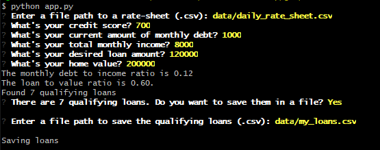

# Loan Qualifier Processing

Finding a bank that will offer a loan satisfying your needs can be time consuming. This project aims to simplify the process by analyzing loan requirements for a selection of banks, then matching them with your particular financial needs and situation. 

---

## Technologies

This Loan Qualifier application is written in Python, and makes use of available libraries to simplify program input:
* [Fire](https://github.com/google/python-fire):  Helps create the command-line-interface (CLI) for the user to input data.
* [Questionary](https://github.com/tmbo/questionary): Mechanisms for prompting the user for data input.

---

## Installation Guide
Check if Fire and Questionary libraries are installed on your system:
```
pip freeze | grep -e 'fire\|questionary'
fire==0.4.0
questionary==1.10.0
```
If your result is similar (exact version numbers are not important), then your installation is complete.
Otherwise, install Fire and Questionary as follows:
```
pip install fire
pip install questionary
```

---

## Usage
The app will ask for the path to a CSV file of bank data. You might want to copy that path so it's ready for pasting when prompted.

If you are qualified for any loans, you will be given the option of saving related data.

Run the app:
```
python app.py
```
From this example, note the data you should have ready before running the program yourself:



---

## Contributors

[David Jonathan](https://www.linkedin.com/in/david-jonathan-1b9470/)

---

## License

Licensed under the [MIT License](https://github.com/tmbo/questionary/blob/master/LICENSE). Copyright 2021 David Jonathan
